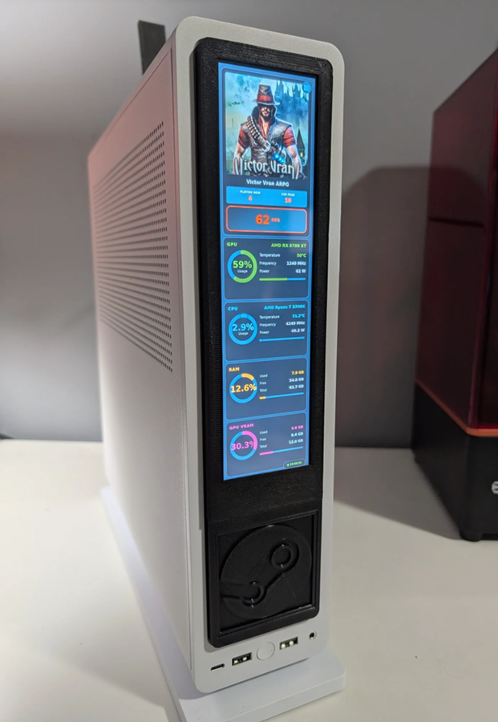
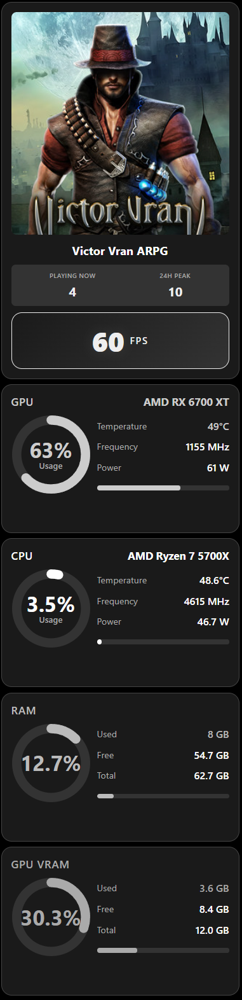
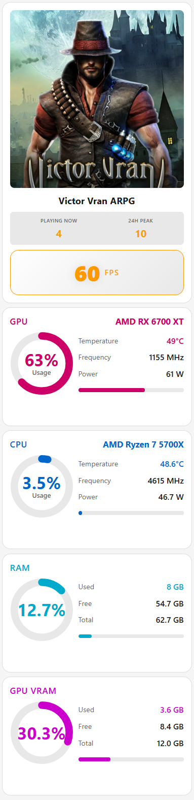
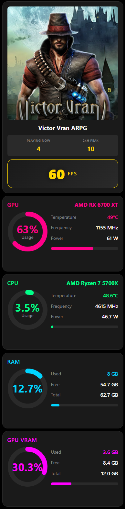

# Linux PC Stats Display

[](https://python.org)
[](https://www.raspberrypi.org/)
[](https://en.wikipedia.org/wiki/Linux)
[](LICENSE)
[](https://ko-fi.com/pyrocac)

Real-time system stats from your Linux gaming PC, displayed on a Raspberry Pi touchscreen. Works on Bazzite, SteamOS, and other Linux distributions.



## Features

- **8 themes** - Dark/Cyberpunk, Light, Matrix, Retro, Nord, Dracula, Black & White, Steam
- **Portrait or landscape** (480×1920 / 1920×480), instant switching, no reboot needed
- **Custom game art** - JPG, PNG, WEBP, animated GIF
- **Live stats** - CPU/GPU/RAM/VRAM, FPS, temps, frequencies, power draw
- **Steam integration** - game name, player count, artwork
- **Touch settings panel** - themes, orientation, network/disk info
- **Auto-start on boot**

| Portrait - B&W | Portrait - Light | Portrait - Cyberpunk |
|---|---|---|
|  |  |  |

## What you need

- A Linux gaming PC running Bazzite or SteamOS
- A Raspberry Pi 3 or newer (4/5 recommended)
- A touchscreen: 480×1920 or 1920×480 - [the display used in this project](https://amzn.to/3YiP0RT)
- Both devices on the same network
- Optional: [3D-printed bezel for the Fractal Ridge case](https://www.printables.com/model/1246939-fractal-design-ridge-lcd-case-mod)

## Install

**On the Raspberry Pi:**
```bash
curl -fsSL https://raw.githubusercontent.com/pyrosplat/Linux-Stat-Display/main/RPI/install.sh -o /tmp/rpi-install.sh && sudo bash /tmp/rpi-install.sh
```

**On the Linux gaming PC:**
```bash
curl -fsSL https://raw.githubusercontent.com/pyrosplat/Linux-Stat-Display/main/LinuxPC/install.sh -o /tmp/pc-install.sh && bash /tmp/pc-install.sh
```
You'll be asked for the Pi's IP address and your preferred orientation. That's it - the display comes up automatically.

Everything the Pi side installs lives in one place: `~/stats-display/` (app, rotation scripts, state, game art). An uninstaller is created automatically at `~/uninstall-stats-display.sh`.

## Custom game art

Drop artwork into `~/stats-display/game_art/` on the Pi, named either by Steam AppID (`1091500.jpg`) or game name (`Cyberpunk 2077.jpg`). `.jpg`, `.png`, `.webp`, and animated `.gif` are all supported. 600×900 (Steam library ratio) looks best.

## FPS detection

Add to your Steam launch options:
```
mangohud %command%
```

## Uninstall

**Raspberry Pi:**
```bash
sudo ~/uninstall-stats-display.sh
```

**Linux PC:**
```bash
~/linux-stats/uninstall.sh
```

## Troubleshooting

| Problem | Check |
|---|---|
| Display not showing stats | `sudo systemctl status stats-display.service` and `sudo journalctl -u stats-display.service -n 50` |
| Orientation change fails | `cd ~/stats-display/scripts && ./rotate-landscape.sh` (or `rotate-portrait.sh`) to test manually |
| Touch not working | `xinput list`, then `DISPLAY=:0 xinput map-to-output <device-id> HDMI-1` |
| Stats not arriving from PC | `systemctl --user status stats-sender.service` and `journalctl --user -u stats-sender.service -f`, then `ping <pi-ip>` |
| Browser not launching | `ls ~/.config/openbox/autostart`, or start manually: `firefox-esr --kiosk --private-window http://localhost:5000 &` |

## Changing the Pi's IP later

```bash
nano ~/linux-stats/stat_sender.py   # update PI_IP
systemctl --user restart stats-sender.service
```

## Compatibility

Tested on Bazzite. Raspberry Pi 3 minimum, 4 recommended, 5 best. Pi Zero/Zero 2W are not recommended (too slow for the web UI).

## License

[CC BY-NC-SA 4.0](LICENSE) - free for personal and educational use, modify and share with credit, no commercial use. For commercial licensing: [ko-fi.com/pyrocac](https://ko-fi.com/pyrocac)

## Support

If this project is useful to you, consider [buying me a coffee](https://ko-fi.com/pyrocac). ☕
